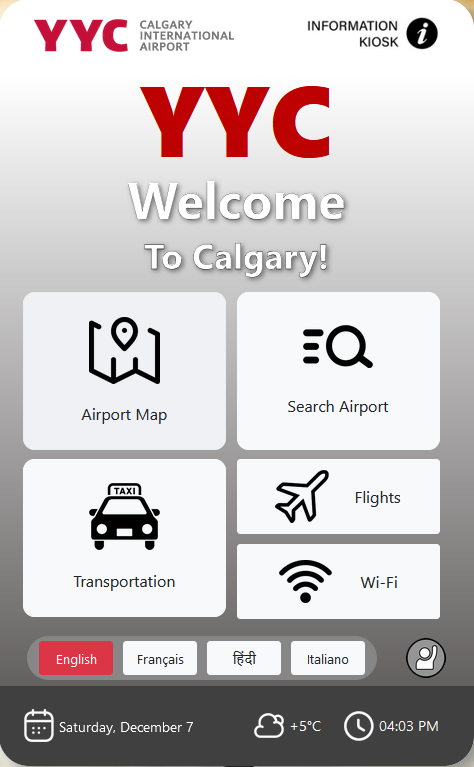
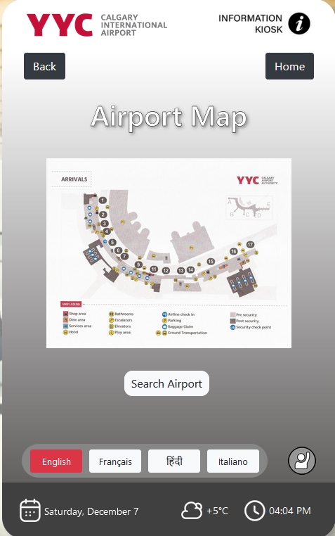
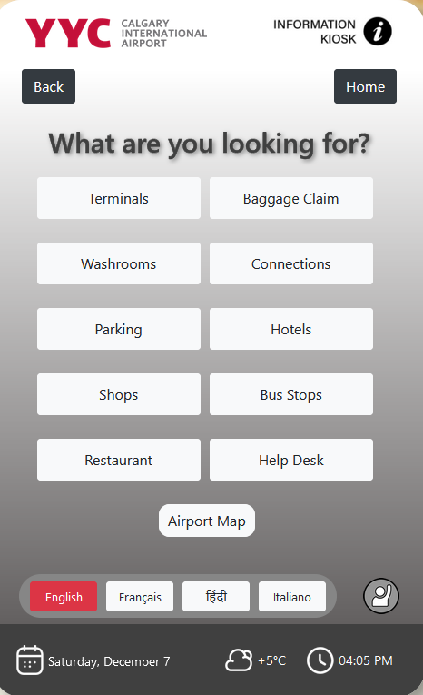
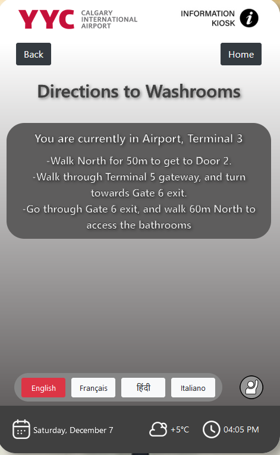
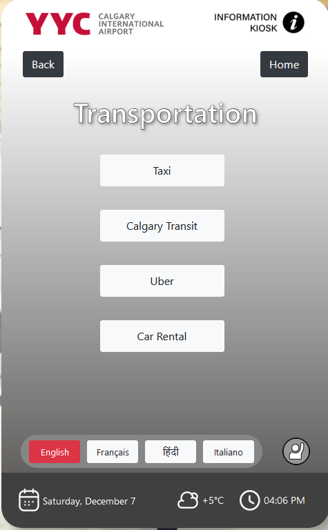
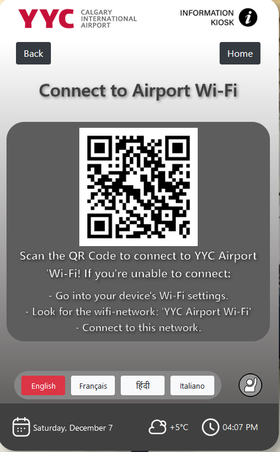
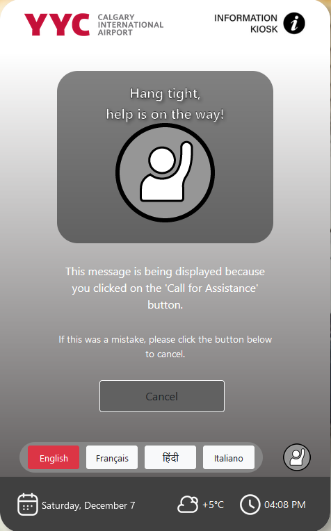

# Airport Information Kiosk

This is a web application which simulates the design of a proposed airport information kiosk for YYC Airport. 

# Tech Stack

This is a standard React + Vite application. It was developed using node v21.1.0. Running the application locally is as simple as:

1. Clone the repository into your desired folder.
2. Run `npm install` within the base directory of the repository.
3. `npm run dev` will run the application locally at http://localhost:5173/.

[React Bootstrap](https://react-bootstrap.netlify.app/) is used as a component library.

# Routes / Pages

## /
Landing page of the kiosk. It is the default setting of the kiosk. Like all pages, it contains a language bar at the bottom to switch the language of the display at any moment, as well as a bottom bar displaying the date, weather, and time.

## /map
This can be accessed by clicking the "Airport Map" button from the landing page. It is a simple, static page displaying an image of YYC airport's map, as well as an option to go to the "Search Airport" page. It also includes a "Back" button to return to the landing page (all pages, which are not the landing page, contain this).

## /search
This can be accessed by clicking the "Search Airport" button from the landing page. It displays a variety of different locations in the airport to select. Clicking an option will take you to the specific page which contains instructions to reach this location (although due to this being a design-oriented PoC, all options lead to the same page).

## /search/washrooms
A page which displays directions for a specific location clicked on within the /search page. All search options lead to this page, although in practice, there would be a separate /search/\<option\> page for each option in the search page.

## /transportation
Similar to the search page, this displays four different options for different transportation options from within YYC Airport -- taxi, transit, uber, and car rental. Clicking a page takes you to a separate page which provides directions to the option that was selected.

## /transportation/calgaryTransit
A page which displays directions for a specific transportation option clicked on within the /transportation page. All transportation options lead to this page, although in practice, there would be a separate /search/\<option\> page for each option in the transportation page.

## /flights
Can be accessed by clicking the "Flights" option from the landing page. Displays a table of current flight information.

## /wifi
Can be accessed by clicking the "Wifi" option from the landing page. Displays a QR code, and instructions, to connect to the wi-fi at YYC Airport.

## /assistance
Can be accessed by pressing the "Call for Assistance" button (to the right of the language bar) from any page on the kiosk. In practice, this would notify airline staff that someone at this particular kiosk is in need of help, and a staff member would appear at this location.

# Screenshots

